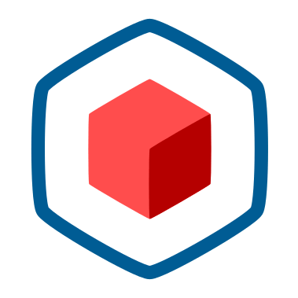



 

Deploy Cloud Native Applications
 
inside Confidential Enclaves

Protect containers <strong>while they are running</strong> using confidential computing and hardware-backed isolation.

<a class="btn btn-lg btn-primary me-3 mb-4" href="/docs/getting-started">
Get Started<i class="fas fa-arrow-alt-circle-right ms-2"></i>
</a>
<a class="btn btn-lg btn-secondary me-3 mb-4" href="/docs/architecture">
How it works<i class="fas fa-arrow-alt-circle-right ms-2"></i>
</a>



  

	What is Confidential Computing?
    

      <button type="button" class="btn btn-primary btn-sm" onclick="location.href='https://confidentialcomputing.io/about';">Learn More</button>
      <button type="button" class="btn btn-secondary btn-sm" data-bs-dismiss="toast">Close</button>
    

  



{}

{}
Protect sensitive models and data while training with cloud hardware.
Run your models in the cloud or create a secure environment where others can run theirs.
{}

{}
Protect banking and health information with technical guarantees.
Enforce compliance with hardware.
{}

{}
Build applications and packages inside sealed environments.
Ground your supply chain in a hardware root of trust.
{}
{}

{}
{}
From day one Confidential Containers has been a collaboration
between several companies building critical components together
and providing security through transparency.
{}

{}
Standardizing confidential computing at the pod level,
Confidential Containers brings hardware platforms and cloud offerings
into one framework for secure applications.
{}

{}
Confidential Containers is a CNCF Sandbox Project
with deep connections to other cloud native projects.
{}
{}

