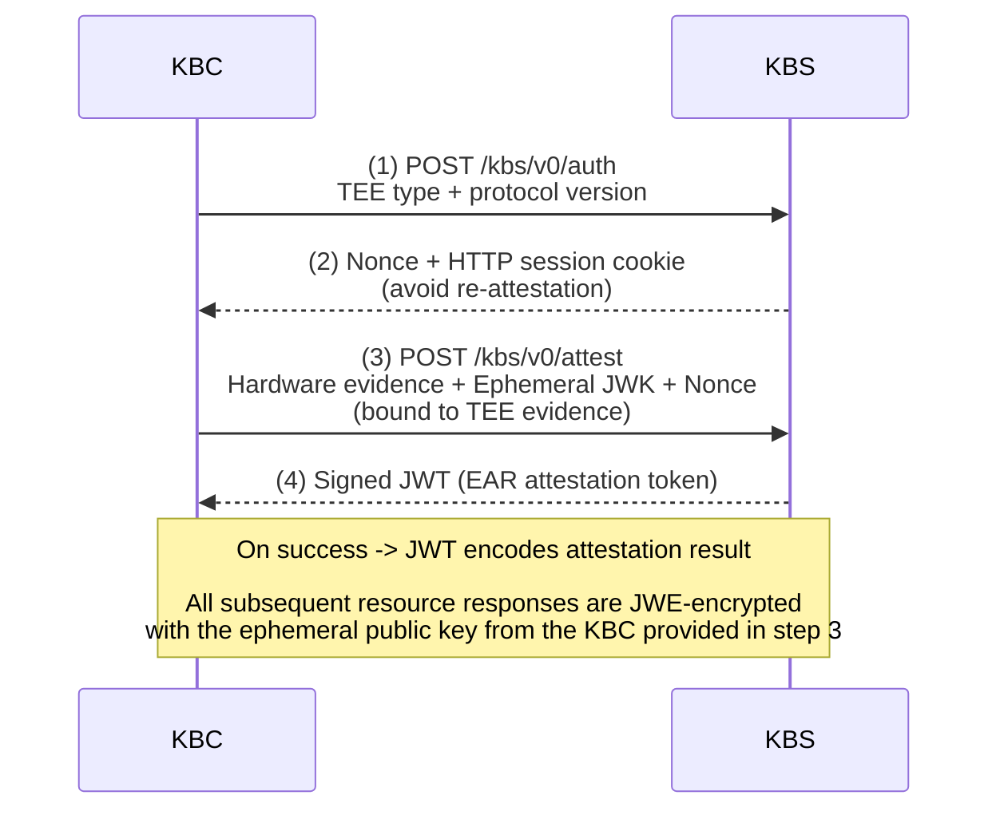
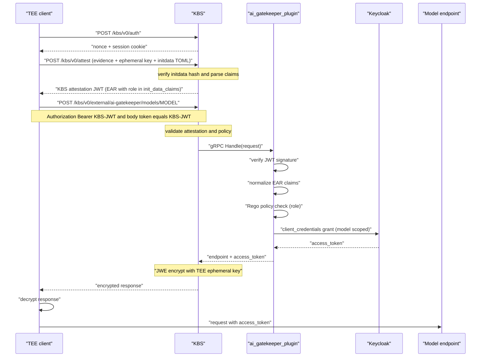

Confidential Computing provides hardware-backed isolation and remote attestation, ensuring workloads execute inside trusted execution environments (TEEs) with verifiable integrity.

Building on this, Confidential Containers extends these guarantees to containerised workloads, integrating TEE-based isolation with cloud-native orchestration so that both the workload and its data remain protected from the underlying infrastructure.

One of the core components of the Confidential Containers stack is [Trustee](https://github.com/confidential-containers/trustee). Trustee introduces policy enforcement into the access path by verifying attestation evidence before releasing resources. Trustee implements a plugin model to make it easier for adding additional functionality based on use cases.

Recently Trustee introduced support for [external plugins](https://github.com/confidential-containers/trustee/pull/1188) for its [Key Broker Service (KBS) component](https://github.com/confidential-containers/trustee/tree/main/kbs). An [external plugin](https://github.com/confidential-containers/trustee/blob/main/kbs/docs/ext_plugin.md) is a standalone gRPC service that KBS invokes *after successful attestation*. With an external plugin service, KBS delegates the response generation to your service, enabling arbitrary, policy-aware, and context-aware logic.

This post explains how the external plugin interface works and walks you through a concrete Python implementation: the [ai-gatekeeper plugin](https://github.com/bpradipt/ai-gatekeeper-kbs-plugin), which brokers controlled access to AI model endpoints for attested TEE workloads.

## Background: KBS and the RCAR Protocol

[**Trustee**](https://github.com/confidential-containers/trustee) is the attestation and secret-provisioning stack for [Confidential Containers (CoCo)](https://github.com/confidential-containers). Its Key Broker Service (KBS) implements a four-step **RCAR** (**Request–Challenge–Attestation–Response)** handshake between a TEE workload (the Key Broker Client, or KBC) and the KBS:



After this handshake, the KBC presents the [JWT](https://github.com/confidential-containers/trustee/blob/main/attestation-service/docs/attestation_token.md) when requesting resources. KBS validates it against policy and returns encrypted data that only the attested workload can decrypt.

The protocol is both **TEE-agnostic** and **transport-agnostic**, supporting platforms such as AMD SEV-SNP, Intel TDX/SGX, Arm CCA, and IBM Secure Execution.

## KBS External Plugins: What They Are

KBS provides a plugin model to extend its capabilities beyond static secret delivery. With the **external plugin interface** KBS gains the ability to connect to remote gRPC servers to provide these extended capabilities.

An external plugin is a standalone gRPC service invoked for requests under:

```text
/kbs/v0/external/<plugin-name>/...
```

#### **Responsibility Split**

**KBS handles:**

* RCAR handshake (attestation gate)
* JWT validation and policy enforcement
* Forwarding requests to the plugin via gRPC
* JWE encryption of plugin responses
* Normalising plugin errors (non-2xx → 401)

**The plugin handles:**

* Business logic and authorization extensions
* Interpretation of attestation claims (including initdata)
* Integration with upstream systems (IdPs, APIs, databases)
* Dynamic response generation (tokens, credentials, decisions)

This separation is the key design point:

KBS remains a minimal, verifiable trust anchor, while plugins become the policy execution layer allowing you to build arbitrarily rich, context-aware access control without weakening the attestation boundary.

### **Configuration**

Register the external plugin in `kbs.toml`:

```toml
[[plugins]]
name = "external"
backends = [
  { name = "my-plugin", endpoint = "http://my-plugin:50051", tls_mode = "insecure", timeout_ms = 10000 },
]
```

Once registered, the plugin is exposed under:

```text
/kbs/v0/external/my-plugin/...
```

At this point, KBS acts as a **policy gate + RPC dispatcher**, forwarding matching requests to the plugin over gRPC.

### **The gRPC Contract**

Every external plugin implements the `kbs.plugin.v1.KbsPlugin` service, which defines three RPCs:

#### **1. `Handle` — Request Execution**

This is the primary entry point. KBS forwards:

* HTTP method
* Path segments (after `/external/<plugin>/`)
* Query parameters
* Request body

The plugin returns:

* Raw response bytes
* HTTP status code
* Content type

This design deliberately keeps KBS **transport-agnostic** while giving the plugin full control over semantics.

---

#### **2. `ValidateAuth` — Who Enforces Authentication?**

This RPC tells KBS *what kind of authentication to enforce before invoking the plugin*:

* `False` (default) → **TEE attestation required** (RCAR session must be valid)
* `Admin auth` → **Admin credentials required**

In practice:

* Use **attestation mode** for workload-facing APIs
* Use **admin mode** for provisioning or control-plane endpoints

---

#### **3. `NeedsEncryption` — Should KBS Encrypt the Response?**

This controls whether KBS applies **JWE encryption** using the TEE’s ephemeral public key:

* `True` → response is encrypted (workload-only visibility)
* `False` → plaintext (typically for operator endpoints)

This is a critical boundary: it ensures the plugin never needs to handle **TEE-specific cryptography** directly.

## The Python SDK for KBS plugin

The [kbs-plugin-sdk-python](https://confidential-devhub.github.io/kbs-plugin-sdk-python/%20) provides a thin abstraction over the gRPC interface, allowing you to focus purely on the business logic.

Install:

```console
$ pip install kbs-plugin-sdk-python
```

The minimal plugin:

```python
import asyncio
from kbs_plugin_sdk import PluginHandler, PluginRequest, PluginResponse, PluginServer

class MyPlugin(PluginHandler):
    async def handle(self, request: PluginRequest) -> PluginResponse:
        return PluginResponse(body=b'{"status": "ok"}', status_code=200)

async def main():
    server = PluginServer(MyPlugin()).with_address("0.0.0.0:50051")
    await server.serve()

asyncio.run(main())

```

By default:

* KBS enforces **attestation**
* Responses are **encrypted**

#### Overriding Defaults

```python
class MyPlugin(PluginHandler):
    def validate_auth(self, request: PluginRequest) -> bool:
        return False   # delegate attestation enforcement to KBS

    def needs_encryption(self, request: PluginRequest) -> bool:
        return True    # KBS JWE-encrypts the response

    async def handle(self, request: PluginRequest) -> PluginResponse:
        ...
```

Add TLS for the KBS -> plugin gRPC channel:

```python
from kbs_plugin_sdk import TlsConfig

server = (
    PluginServer(MyPlugin())
    .with_address("0.0.0.0:50051")
    .with_tls(TlsConfig.server_tls("/etc/plugin/server.crt", "/etc/plugin/server.key"))
)
await server.serve()
```

This secures the **control-plane channel**, complementing the **data-plane encryption (JWE)** handled by KBS.

## Complete Example: AI Gatekeeper Plugin

The `ai-gatekeeper-kbs-plugin` is a concrete implementation of external plugin. The code is available at [https://github.com/confidential-devhub/ai-gatekeeper-kbs-plugin](https://github.com/confidential-devhub/ai-gatekeeper-kbs-plugin)

Its purpose is to gate access to **AI model inference endpoints** for attested TEE workloads.

#### **What It Does**

1. Independently re-verifies the KBS-issued JWT
2. Extracts normalized claims (including `init_data_claims`)
3. Evaluates authorization policy using OPA (Rego)
4. Exchanges credentials with Keycloak
5. Returns:

```json
    {
      "endpoint": "...",
      "access_token": "..."
    }

    (JWE-encrypted by KBS)
```

### **Complete Request Flow**



### **Why does the JWT Appear Twice?**

You’ll notice the JWT is sent:

* In the **Authorization header** (Bearer token)
* In the **request body**

This is intentional and reflects a subtle boundary in KBS design:

* The **header** is consumed by KBS to enforce the attestation gate
* The **body** is forwarded untouched to the plugin

Since the plugin does not receive HTTP headers via gRPC, the client includes the JWT in the body so the plugin can:

* Inspect claims
* Apply additional policy
* Perform independent verification

This separation ensures:

* KBS remains the **root of trust**
* Plugins operate as **policy extensions**, not trust anchors

In future we might include additional details from the KBS to the plugin.

### **The Handler (Simplified)**

```python
class GatekeeperHandler(PluginHandler):
    def validate_auth(self, request):
        return False   # KBS enforces RCAR attestation; plugin layer is additive

    def needs_encryption(self, request):
        return True    # response carries live credentials; TEE-only decryption required

    async def handle(self, request: PluginRequest) -> PluginResponse:
        # path: ["models", "<model-name>"]
        if len(request.path) < 2 or not request.path[1]:
            return PluginResponse(body=b"missing model in path", status_code=400)

        model_name = request.path[1]

        # JWT is in the request body — not the Bearer header (which KBS consumes)
        try:
            token = json.loads(request.body)["token"]
        except (json.JSONDecodeError, KeyError):
            return PluginResponse(body=b"missing token", status_code=400)

        # Layer 2: plugin independently re-verifies the KBS-issued JWT
        try:
            ear_claims = self._verifier.verify(token)
        except Exception:
            return PluginResponse(body=b"invalid token", status_code=401)
        normalized = normalize_ear_claims(ear_claims)

        if not await self._rego.allow(normalized, model_name):
            return PluginResponse(body=b"access denied", status_code=403)

        model = self._config.models.get(model_name)
        if model is None:
            return PluginResponse(body=b"unknown model", status_code=404)

        access_token = await self._kc.get_token(model.scope)
        out = json.dumps({"endpoint": model.endpoint, "access_token": access_token})
        return PluginResponse(body=out.encode(), status_code=200)
```

### **Role Derivation via Initdata**

The role lives in the [initdata](https://confidentialcontainers.org/docs/features/initdata/) TOML, the TEE provides at attestation time:

```toml
algorithm = "sha256"
version = "0.1.0"

[data]
role = "premium"
"aa.toml" = '''
[token_configs.kbs]
url = "http://kbs:8080"
'''
...

```

At runtime:

* KBS hashes this TOML and verifies it against the **TEE** measurement
* The workload cannot mutate initdata post-attestation

Once verified:

* KBS parses the TOML
* Injects it into the JWT as `init_data_claims`

The plugin can then derive role information directly:

```text
init_data_claims["role"]  ->  "premium"
```

This mechanism effectively binds **authorization context (role)** to **attested state**, without requiring image changes.

### **The Rego Policy**

The plugin delegates authorization to an Open Policy Agent sidecar via:

```text
POST /v1/data/ai_gatekeeper/allow
```

#### **Policy (Simplified)**

```rego
package ai_gatekeeper

import rego.v1

default allow := false

role := r if {
   r := input.claims.init_data_claims["role"]
}

allow if {
   allowed_models[role][input.model]
}

# Measurement-based override
allow if {
   input.claims.tee_type == "tdx"
   input.claims.measurement == "replace-with-your-mr-td"
   allowed_models.research[input.model]
}

allowed_models := {
   "basic":    {"llama-8b":  true},
   "premium":  {"llama-8b":  true, "llama-70b": true},
   "research": {"llama-8b":  true, "llama-70b": true},
}
```

#### **Key aspects**

* **Role-based control** based on initdata
* **Measurement-based override** enables enclave-specific exceptions
* **Declarative** policy

If OPA is unreachable, the plugin evaluates to **deny.**

### **The Keycloak Exchange**

Once policy evaluation succeeds, the plugin exchanges credentials with Keycloak using the `client_credentials` grant, requesting a scope specific to the model:

```python
async def get_token(self, scope: str) -> str:
    async with httpx.AsyncClient(timeout=self._timeout) as client:
        r = await client.post(
            self._token_url,
            data={
                "grant_type": "client_credentials",
                "client_id": self._client_id,
                "client_secret": self._client_secret,
                "scope": scope,       # e.g. "model:llama-70b"
            },
        )
        r.raise_for_status()
        return r.json()["access_token"]
```

### **Error Normalization**

Per the external plugin specification:

* KBS **normalizes all non-2xx plugin responses to `401`** for the client

Internally, the plugin uses fine-grained status codes, visible in the logs:

* `400` → malformed request
* `401` → invalid JWT
* `403` → policy denial
* `404` → unknown model
* `5xx` → upstream failures

## **Running the Stack Locally**

The repository provides two deployment modes:

#### **1. E2E (CI-Friendly)**

Fast, self-contained setup using a mock identity provider:

```console
$ make e2e
```

#### **2. Demo (Full Stack)**

Includes:

* Real Keycloak (v26.6.1)
* Mock OpenAI-compatible model endpoints
* Full plugin + OPA integration

```console
$ cd demo
$ make demo
```

Or for an interactive walkthrough:

```console
$ make up
$ make demo-client
```

### **What the Demo Covers**

The demo exercises all critical paths:

* Successful access based on role (`basic`, `premium`)
* Policy denial
* Unknown model requests
* Tampered tokens
* Scope mismatch (token valid but not authorized for model)

This validates not just functionality, but also the **end-to-end security invariants**:

* Attestation-bound identity
* Policy-driven authorization
* Scoped credential issuance
* Resource-side enforcement

## Final Takeaway

The plugin model provides a flexible framework to extend Trustee.  The external
plugins provides you the capability to write and maintain your own custom
plugins in a language of your choice.

The plugin architecture achieves a clean separation of concerns:

* **Trustee KBS** remains the minimal, verifiable trust anchor, handling
  hardware attestation, cryptographic enforcement, and the core policy gate.
* **Internal Plugins** core plugins maintained by the community.
* **External Plugins** (e.g., the AI Gatekeeper) your own custom plugins
  to extend Trustee KBS for your use cases

I hope this helps. Reach out to [us](https://confidentialcontainers.org/docs/contributing/#connecting-with-the-community) if you need any help.

## References

* [https://confidential-devhub.github.io/kbs-plugin-sdk-python/](https://confidential-devhub.github.io/kbs-plugin-sdk-python/)
* [https://github.com/bpradipt/ai-gatekeeper-kbs-plugin](https://github.com/bpradipt/ai-gatekeeper-kbs-plugin)

