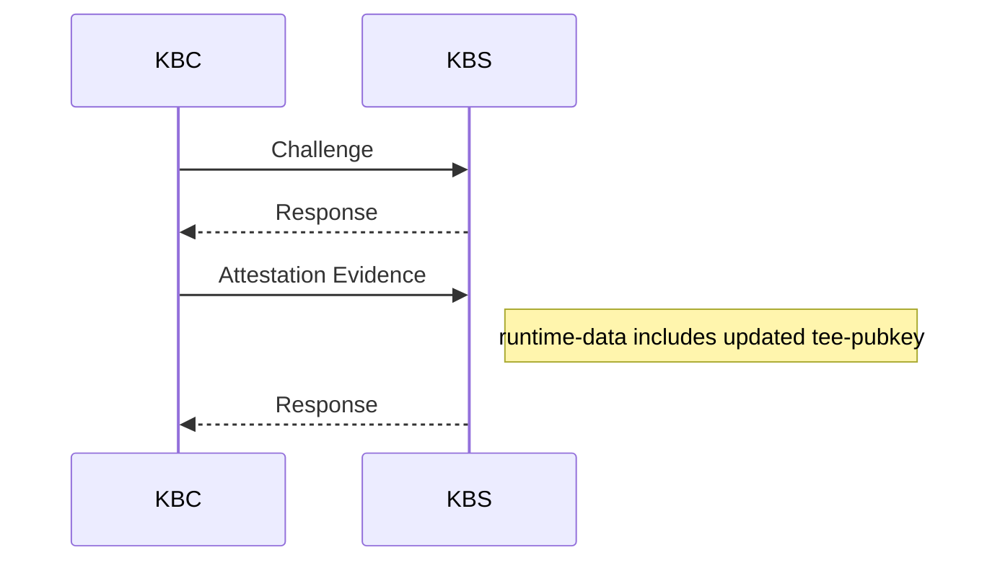

## Introduction

Those who are interested in Confidential Containers as a framework, already have a high bar for security. The delivery of resources from the trusted Trustee services into untrusted guest components requires resources to be secured in transit once the request has been attested to. A recent change to the [TLS version supported](https://github.com/confidential-containers/trustee/pull/1259) by the Key Broker service has lead to the possibility of PQC support at the transport layer through hybrid key exchange. This change to the KBS protocol delivers this at the application layer by encrypting responses using JSON Web Encryption methods. The purpose of this change is to make available post quantum cryptographic methods in the protocol as an alternative to RSA (RSAES-OAEP) and Elliptic Curve key methods.

## Integration Points

This change has been integrated into the [KBS Attestation Protocol](https://github.com/confidential-containers/trustee/blob/main/kbs/docs/kbs_attestation_protocol.md) workflow.

Consider the attestation exchanges in the existing protocol below



The overall workflow remains intact, however the attestation evidence sent by the Key Broker Client (KBC), can include a public key in the new "AKP" key type format, as an alternative to the existing options for "EC" and "RSA". The JSON format for the AKP public key type which is part of `runtime-data` in the attestation evidence paylod, is as follows. The values show by way of example how this might serialise:-

```json
"tee-pubkey" {
  "kty": "AKP",
  "alg": "ML-KEM-768+A192KW",
  "pub": "ZtzhX7M96stcA2LzDpX1Lmr0Y7tH1JnHvK5BmRQsy5hm1vAneRgictJB7yfW9JcZSpHeDspVkXVXuL3ddO1tVWOs4pln65Iklz5EtYKgoKaVBkUFNP1wDgEDTPhX6dS46_Ua1Z39RPAl21s2gQkzAL8UjC67kwH-FJnzLqBEE57L0eJNOU2VnBVwVob8GM8B6_KTblhr5wUw_o1K2qFXhjpkopz-SV1mqd61I_9H8gvb_clKuwpI-c_jyV0O55Y7vQDBdL37MReuSgHJvYtOnjLSHTNrB-lhNt6kg_MEtfs_e6iX-MV9d4Is5AvkDSXcMg-Im4aiKK4UeKcrSOtTc6Y4pxARVWUDgynq8lgiNPE7qTP3DagzkPEg8875p6piCCv7TVldFgQ0CgEZgdsbO1PlKa9b2LM9btWtcLtb6q7G5T0fq70onPzpw34HQ0zVrq_NCCKgYSzNOMnoUIwcZKNnP0IxBqcuZw-bqYNdX8EBTMxP_QPXbIUtI4U1qjs1aTT1iwPPVJE1n1Iv3CUECL6yNviR-Z_X2RpvxisWI3OhAIPwyZAoZb1nE-XjgzntDfkPmV5_Lrov8__rDi2YU8dxpxbNnQiS1u4rMvtkVYX4A5QLvV4P9ifZSFPUXjPYz1qAY-xeUL9RIXdFbkMpijQkKNQXUzWWmS9UW9j4Gvf7UutHu5hmm3sh7ors4adGKJwTJJyU2EsOyFzNLO9OKkDAFRNYvwAERp-k_AgKZGxX1bHFgPQWZesH3zKHCiJL1-VpAT68mgOKFMLQ8lXnMlCa9LSHgRq2ojaguqLxSMog-XHFejEgmwSX9BLpDSLt5mjEW_n7rKYomKkdG8w66oZY9NzIIJzZR3eQnwszD3Ohu7VUIMxsGC9cRRD28e1elomcTz0uOavXNj9TJON5qmJ4x7qrSl-XZ_c2o9UqVEbaXyDjIqatj8AT43jifgdiZLqdHq4fwvjNNZe2gmpS2QDPwsIERMO42dyvj_aBaTz-Gl7FjbGNQWZjaX4a21kKiNHRhc4A7rUOVHNtWVdjHCnegQZ7W3hwzMWeG7LeozM-vgsIX8NQ5ebK66Lw3LF5M6J5UPzTMpBfsDGCg1cNst1GVujkOasjlp3RP-YYu5rs2g5pjgYziqrMa8Ec0vszI4SSOgzaXvGf9LQTRj9PmbomLUrybN2xVcxFKRtXZuFBqgDuqarVnyz64M49pq5LuL8movSrARuFChjfG3PfdBt0vc1rtus3Kw7DL1NloGodv37kvace4kpVEop_RghT-WW0zvYnQR9bPWbl2FU2W-asaFG96CXo4FwsHIB1qkV49Vk6GgXPpb3vVm14GiIAc2pp0czzQVro1ljcAiUGTmadxwHF4iYqx1XAgpoVuoiIcttqPdEdfKQO3DjgfEOxMn-vHuk0-ESr8m1WlwJ_Ps6HYvE6HxUrdW29Up_uADhfds-E18XfjugM-bOzzmFncNQWXT3HnBDwtcb4uZkAQTPyYvYLRTM__c10QCb_QLKBrUt_gl1XtnBcBk1kBuklcE7rSLfra_9QbHEJusJLRHBoDJwBcAP6gZKvgNu4OWk
"
}
```
Using the ML-KEM PQC algorithm, the encapsulation process produces a shared secret, generated from the AKP public key together with KEM ciphertext. The shared secret remains with the Key Broker Service (KBS) and the KEM ciphertext will be returned in the protected header as part of the resource response. The KEM ciphertext together with the decapsulation key originally created by the KBC can generate the same shared secret from which a wrapping / unwrapping symetric key can be derived. The unwrapping key is then used to unwrap the content encryption key (CeK), itself a symmetric key used to encrypt the resource payload at the trustee and now decrypt in guest services by the KBC.

## Standards

The introduction of PQC support is based on draft jose standards for public key encryption

### [Use of Hybrid Public Key Encryption (HPKE) with JSON Web Encryption (JWE)](https://datatracker.ietf.org/doc/draft-ietf-jose-hpke-encrypt/)

This standard, at version 22 at the time of this blog publication, but originally at version 11 at the time of deciding to proceed with this change, was considered as the basis for the change. It is a public key encryption scheme enabling JSON Web Encyption (the format, already an established part of the KBS protocol). However the standard name is somewhat misleading as although it is billed as Hybrid Public Key Encryption, it doesn't actually define a post quantum KEMs as part of the standard, just classic Diffie-Hellman based KEMs.

### [draft-ietf-jose-pqc-kem](https://datatracker.ietf.org/doc/draft-ietf-jose-pqc-kem/)

This standard is the basis of the change and specifically describes how ML-KEM is used to protect the confidentiality of content encrypted with CBOR Object Signing and Encryption (COSE). The standard defines important data definitions which have been mapped on to [kbs-types](https://github.com/confidential-containers/kbs-types) data structures.

The "AKP" key type defined in the standard is used to define the key type in the `TeePubKey` which is passed as part of the attestation token in the resource request. The mandatory use of the "alg" parameter is honoured in the implementation to define the ML-KEM algorithm.

```json
{
  "alg":"ML-KEM-768+A192KW",
  "kty":"AKP",
  "pub":"....."
}
```

The final response includes the "KEM Cipher text", produced as an output of the encapsulation process and required by KBC for decapsulation. The standard defines the "ek" as the shorthand name for this data item. The implemenation presents this back in the reponse as part of the `other_fields` map defined in the ProtectedHeader data structure.

```json
{
  "protected": "{"alg":"ML-KEM-768+A192KW","enc":"A256GCM","other_fields":["ek":"<KEM ciper text>"]}",
  "encrypted_key": "..",
  "aad": "..",
  "iv": "..",
  "ciphertext": "..",
  "tag": ".."
}

```

## Other Implementation Decisions

The implementation is an experimental feature and needs to be enabled at build time in both guest components and the trustee. If enabled in the trustee, the trustee service can continue to serve all `TeePubKey` types and would interoperate with guest component builds which do not have the experimental feature enabled. However if enabled in guest components, the feature must be enabled in the trustee in order to process the new key type.

The decision to use feature flagging was made in light of the fact that standards which have informed the implementation are in draft status. So rather than make the use of this key type part of a standard build, where changes in the draft standards could undermine the credibility of the implementation, the feature has been designated as experimental. This provides the benefits of this implementation to users who demand post quantum security while leaving the default build unimpacted. Although "classic" cryptography is not yet defeated by a credible quantum threat, the threat does have immediate ramifications. "Harvest now, decrypt later", is the idea that classically encrypted data is harvested now and can then decrypted at a future time. It's on the minds of CSOs and getting broader recognition in board rooms and so offering protection against this credible threat is a timely move.

### ML-KEM-768+A192KW

The implementation uses this algorithm rather than other options such as MLKEM1024+A256KW which have longer key lengths and a higher NIST security level. The reason for this is tactical given the experimental status of this feature. It is the current default for hybrid TLS and is adequate for general use, not overly burdensome on compute requirements and key lengths. As standards mature from draft status to fully agreed standards other recommendations may be offered.

## Enabling The Feature

The feature can be enabled by following the [documented build processes for experimental features](https://github.com/confidential-containers/trustee/blob/main/kbs/README.md#experimental-features) in the Key Broker Service as part of the [trustee](https://github.com/confidential-containers/trustee) repository and applying the `pqc-experimental` feature in the build of the `kbs_protocol` package inside the [guest-components](https://github.com/confidential-containers/guest-components) repository.

With the feature enabled build, the trustee attester tool for example will set the TEE key algorithm to ML-KEM-768+A192KW which will drive the key type used in the encryption of the content encryption key used as part of the Key Attestation Protocol.

Using the key type and public key will drive further logic in trustee to derive a shared secret through encapsulation. The returned KEM ciphertext as described above will be used in conjunction with the decapsulation key in the guest components to decrypt the content encryption key which subsequently enables the decryption of the response payload containing the requested resource.
