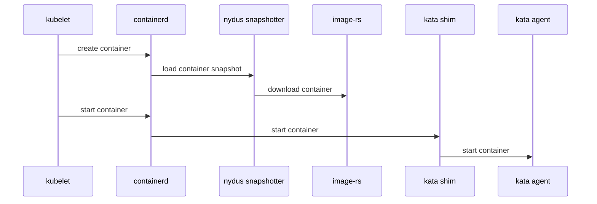
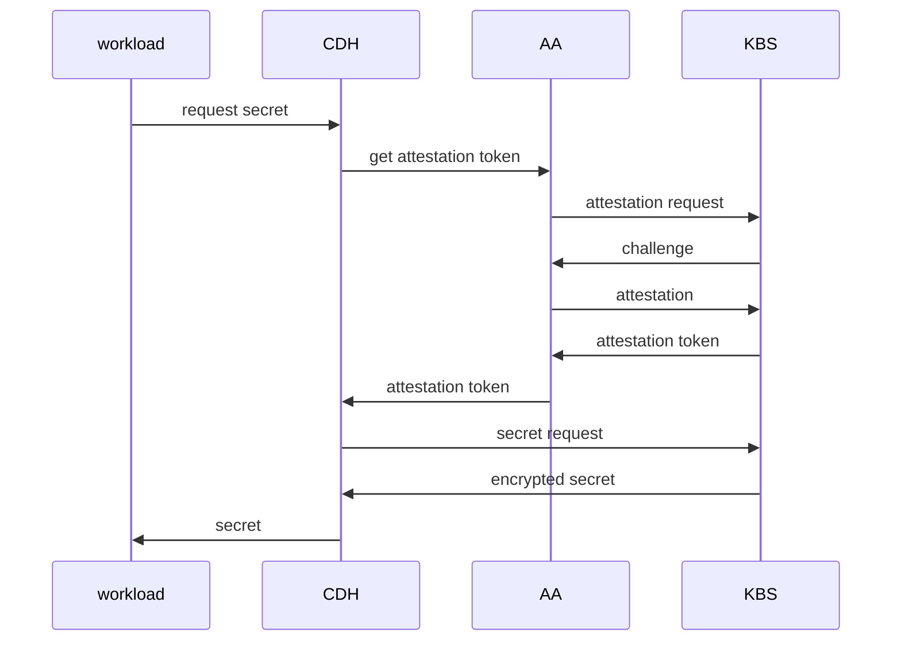
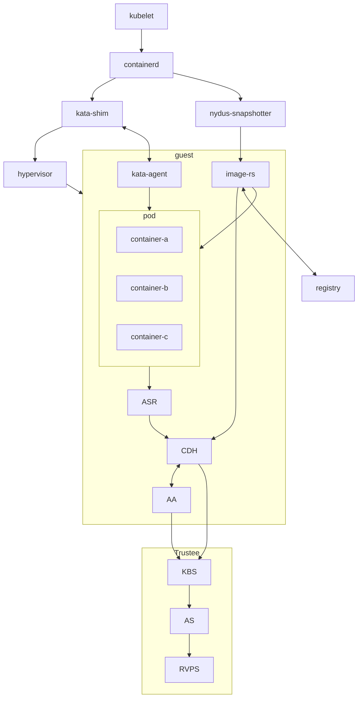
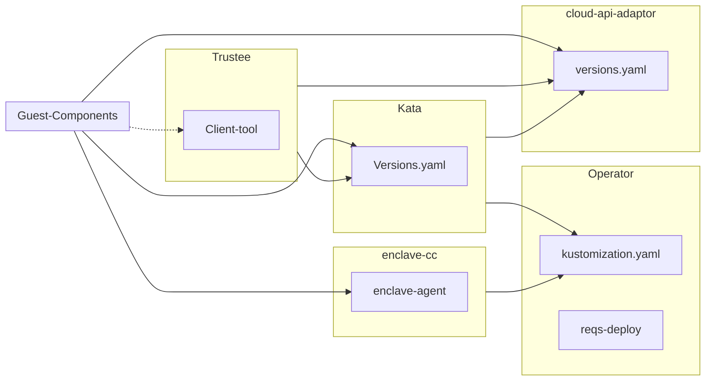

Confidential computing projects are largely defined by what is inside the enclave and what is not.
For Confidential Containers, the enclave contains the workload pod and helper processes and daemons
that facilitate the workload pod.
Everything else, including the hypervisor, other pods, and the control plane, is outside
of the enclave and untrusted.
This division is carefully considered to balance TCB size and sharing.



When trying to combine confidential computing and cloud native computing, often the first thing that comes to mind
is either to put just one container inside of an enclave, or to put an entire worker node inside of the an enclave.
This is known as container-centeric virtualization or node-centric virtualization.
Confidential Containers opts for a compromise between these approaches which avoids some of their pitfalls.
Specifically, node-centric approaches tend to have a large TCB that includes components such as the Kubelet.
This makes the attack surface of the confidential guest significantly larger.
It is also difficult to implement managed clusters in node-centric approaches because the workload runs in the
same context as the rest of the cluster.
On the other hand, container-centric approaches can support very little sharing of resources.
Sharing is a loose term, but one example is two containers that need to share information over the network.
In a container-centric approach this traffic would leave the enclave.
Protecting the traffic would add overhead and complexity.

Confidential Containers takes a pod-centric approach which balances TCB size and sharing.
While Confidential Containers does have some daemons and processes inside the enclave,
the API of the guest is relatively small.
Furthermore the guest image is static and generic across workloads and even platforms,
making it simpler to ensure security guarantees.
At the same time, sharing between containers in the same pod is easy.
For example, the pod network namespace doesn't leave the enclave,
so containers can communicate confidentially on it without additional overhead.
These are just a few of the reasons why pod-centric virtualization seems to be the best way
to provide confidential cloud native computing.

### Kata Containers

Confidential Containers and Kata Containers are closely linked, but the relationship might not be obvious at first.
Kata Containers is an existing open source project that encapsulates pods inside of VMs.
Given the pod-centric design of Confidential Containers this is a perfect match.
But if Kata runs pods inside of VM, why do we need the Confidential Containers project at all?
There are crucial changes needed on top of Kata Containers to preserve confidentiality.

#### Image Pulling

When using Kata Containers container images are pulled on the worker node with the help of a CRI runtime like `containerd`.
The images are exposed to the guest via filesystem passthrough.
This is not suitable for confidential workloads because the container images are exposed to the untrusted host.
With Confidential Containers images are pulled and unpacked inside of the guest.
This requires additional components such as `image-rs` to be part of the guest rootfs.
These components are beyond the scope of traditional Kata deployments and live in the Confidential Containers
[guest components](https://github.com/confidential-containers/guest-components) repository.

On the host, we use a snapshotter to pre-empt image pull and divert control flow to `image-rs` inside the guest. 

The above is a simplified diagram showing the interaction of containerd, the nydus snapshotter, and image-rs.
The diagram does not show the creation of the sandbox.

#### Attestation

Confidential Containers also provides components inside the guest and elsewhere to facilitate attestation. 
Attestation is a crucial part of confidential computing and a direct requirement of many guest operations.
For example, to unpack an encrypted container image, the guest must retrieve a secret key.
Inside the guest the `confidential-data-hub` and `attestation-agent` handle operations involving
secrets and attestation. 
Again, these components are beyond the scope of traditional Kata deployments and are located in the
[guest components](https://github.com/confidential-containers/guest-components) repository.

The CDH and AA use the KBS Protocol to communicate with an external, trusted entity. 
Confidential Containers provides [Trustee](https://github.com/confidential-containers/trustee)
as an attestation service and key management engine that validates the guest TCB and releases secret resources.

The above is a somewhat simplified diagram of the attestation process.
The diagram does not show the details of how the workload interacts with the CDH.

#### Putting the pieces together

If we take Kata Containers and add guest image pulling and attestation,
we arrive at the following diagram, which represents Confidential Containers.

### Clouds and Nesting

Most confidential computing hardware does not support nesting.
More specifically, a confidential guest cannot be started inside of a confidential guest,
and with few exceptions a confidential guest cannot be started inside of a non-confidential guest.
This poses a challenge for those who do not have access to bare metal machines
or would like to have virtual worker nodes.

To alleviate this, Confidential Containers supports a deployment mode known as Peer Pods,
where a component called the Cloud API Adaptor takes the place of a conventional hypervisor.
Rather than starting a confidential PodVM locally, the CAA reaches out to a cloud API.
Since the PodVM is no longer started locally the worker node can be virtualized.
This also allows confidential containers to integrate with cloud confidential VM offerings. 

Peer Pods deployments share most of the same properties that are described in this guide.

### Process-based Isolation

Confidential Containers also supports SGX with enclave-cc.
Because the Kata guest cannot be run as a single process, the design of enclave-cc
is significantly different.
In fact, enclave-cc doesn't use Kata at all, but it does still represent a pod-centric approach
with some sharing between containers even as they run in separate enclaves.
enclave-cc does use some of the guest components as crates.

### Components

Confidential Containers integrates many components. Here is a brief overview of most the components related to the project.

| Component | Repository | Purpose |
| --------- | ---------- | ------- |
| Operator  | operator | Installs Confidential Containers |
| Kata Shim | kata-containers/kata-containers | Starts PodVM and proxies requests to Kata Agent |
| Kata Agent | kata-containers/kata-containers | Sets up and runs the workload inside of a VM |
| image-rs | guest-components | Downloads and unpacks container images |
| ocicrypt-rs | guest-components | Decrypts encrypted container layers |
| confidential-data-hub | guest-components | Handles secret resources |
| attestation-agent | guest-components | Attests guest |
| api-server-rest | guest-components | Proxies requests from workload container to CDH |
| key-broker-service | Trustee | Coordinates attestation and secret delivery (relying party) |
| attestation-service | Trustee | Validate hardware evidence (verifier) |
| reference-value-provider-service | Trustee | Manages reference values |
| Nydus Snapshotter | containerd/nydus-snapshotter | Triggers guest image pulling |
| cloud-api-adaptor | cloud-api-adaptor | Starts PodVM in the cloud |
| agent-protocol-forwarder | cloud-api-adaptor | Forwards Kata Agent API from cloud API |

#### Component Dependencies

Many of the above components depend on each other either directly in the source,
during packaging, or at runtime.
The basic premise is that the operator deploys a special configuration of Kata containers
that uses a rootfs (built by the Kata CI) that includes the guest components.
This diagram shows these relationships in more detail.
The diagram does not capture runtime interactions.

### Workloads

Confidential Containers provides a set of primitives for building confidential Cloud Native applications.
For instance, it allows a pod to be run inside of a confidential VM,
it handles encrypted and signed container image, sealed secrets,
and other features described in the features section.
This does not guarantee that any application run with Confidential Containers is confidential or secure.
Users deploying applications with Confidential Containers should understand the attack surface
and security applications of their workloads, focusing especially on APIs that cross the confidential
trust boundary. 
