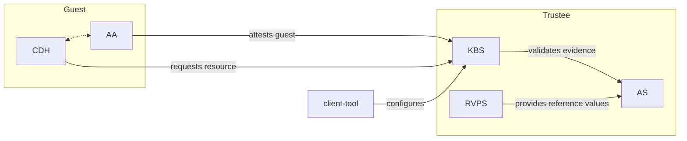

Before a confidential workload is granted access to sensitive data, it should be attested.
Attestation provides guarantees about the TCB, isolation properties, and root of trust of the enclave.

Confidential Containers uses Trustee to verify attestations and conditionally release secrets.
Trustee can be used to attest any confidential workloads. It is especially integrated with Confidential Containers. 

Trustee should be deployed in a trusted environment, given that its role validating guests and releasing secrets
is inherently sensitive.

There are several ways to configure and deploy Trustee.

## Architecture

Trustee is a composition of a few different services, which can be deployed in several different configurations.
This figure shows one common way to deploy these components in conjunction with certain guest components.

### Components

| Component | Name | Purpose | 
| --------- | ---- | ------- | 
| KBS | Key Broker Service | Facilitates attestation and conditionally releases secrets |
| AS | Attestation Service | Validates hardware evidence |
| RVPS | Reference Value Provider Service | Manages reference values |
| CDH | Confidential Data Hub | Handles confidential operations in the guest |
| AA | Attestation Agent | Gets hardware evidence in the guest |

### KBS Protocol

Trustee and the guest components establish a secure channel in conjunction with attestation.
This connection follows the KBS protocol, which is specified [here](https://github.com/confidential-containers/trustee/blob/main/kbs/docs/kbs_attestation_protocol.md)
