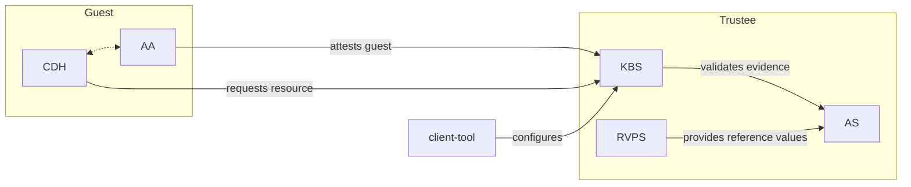
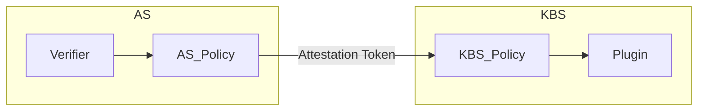

## Overview

Trustee has three main components.

### Key Broker Service

The Key Broker Service or KBS is the front door of Trustee.
Guests connect to the KBS via the KBS protocol.
The KBS protocol is designed to create a secure channel
between the KBS and the guest, that is bound to fresh
attestation evidence.
More information about the KBS protocol can be found [here](https://github.com/confidential-containers/trustee/blob/main/kbs/docs/kbs_attestation_protocol.md).
The KBS facilitates this flow, using the Attestation Service
to validate the evidence, before serving a resource request
from local storage, a plugin, or an external KMS/HSM.
Before releasing a resource, the KBS executes a policy.
The details of the policy are described below.

The Key Broker service is configured via a static configuration
file. Configuration details can be found [here](https://github.com/confidential-containers/trustee/blob/main/kbs/docs/config.md).

### Attestation Service

The Attestation Service or AS processes hardware evidence
and returns an EAR attestation token representing the TCB.
The AS has a modular verifier interface, with verifiers
for each supported hardware platform.
The mapping of the TCB to the attestation token is controlled
by the attestation policy, which is described below.

### Reference Value Provider Service

The Reference Value Provider Service (or RVPS) manages reference values.
The RVPS extracts reference values from various manifest formats
and provides them to the AS.

## Why so many policies?

Both the KBS and AS have a policy.
At first this might seem confusing, but the two policies have distinct
purposes that correspond to the scope of their respective components.

Processing hardware evidence and releasing confidential resources
is relatively complicated. Trustee does this in a few decoupled steps,
which are described below, starting with the verifiers,
which are essentially the bottom of the stack.
This description starts with the evidence having already been passed
to the verifiers and shows how it is processed by the verifier,
AS, KBS, and ultimately used to provide a resource.

The policies are user-defined, allowing for some variation,
but the basic model is described below.

### Verifier

First, the verifier validates the hardware evidence and extracts TCB claims.
Validating the evidence usually means checking that the evidence is signed
by the platform manufacturer or some chain of trust that is anchored by
the hardware manufacturer.
In other words, the verifier checks the endorsement of the hardware evidence.

If the evidence is valid, the verifier extracts all of the relevant information
as TCB claims.

A verifier is scoped to a hardware platform or device, and more specifically
the attestation primitives (e.g. measurement registers) of a platform or device.
Since these primitives are relatively static, and since processing hardware evidence
often involves working with binary data, the verifiers are written in Rust.
This code can be re-used with many different runtimes and workloads. Furthermore, verifiers
can be composed together as described in the device attestation section below.

For a listing of TCB claims available on each platform, see [here](https://github.com/confidential-containers/trustee/blob/main/attestation-service/docs/tcb_claims.md).

### Attestation Policy

Next, the attestation policy compares the TCB Claims from the verifier
to reference values provided by the RVPS.

The attestation policy is scoped to the runtime.
Among other things, a runtime determines how a guest boots, which determines
how the attestation primitives are used, and ultimately how the TCB claims
should be compared to reference values.

Since there are many different runtime implementations, this logic is captured
in an OPA policy.
The default policy is scoped to Confidential Containers.
Most users of Confidential Containers won't need to change the attestation policy.
This policy may be suitable for other runtimes as well,
but a user might need to tweak the policy if their runtime has a significantly
different boot process.

The output of the attestation policy is an AR4SI trust vector.
This is a generic way of representing TCB status.
This result is one of the main components of the attestation token.

There will be one policy evaluation, and one trust vector, per device.

In addition to the trust vector, the attestation policy can also return other
extensions that will be added to the policy.
This can include an identifiers extension which contains any information from the runtime
that identifies which workload is running.

For more information on the attestation policy, see [here](https://github.com/confidential-containers/trustee/blob/main/attestation-service/docs/policy.md).

### Attestation Token

The Attestation Token represents the TCB state and the attestation process.
The token is a generic interface between the AS and the KBS, although it also
contains the raw evidence and TCB claims.

For more information on the attestation token, see [here](https://github.com/confidential-containers/trustee/blob/main/attestation-service/docs/attestation_token.md).

### KBS Policy

The KBS policy (sometimes referred to as the resource policy) determines whether a
particular resource request should be fulfilled by the KBS.
The input to this policy is a URI representing the resource and the attestation token.
Generally the KBS policy does not concern hardware-specifics.
Rather, it evaluates the guest in terms of the generic AR4SI vector(s).

More information on the KBS Policy can be found [here](../policies#resource-policies).

### KBS Plugin

KBS Plugins fulfill resource requests. A plugin can give out pre-provisioned resources,
proxy requests to external KMSes, or generate resource data on the fly.
The resource backend, which is the most common place to store resources, is a plugin.
Generally these artifacts are all referred to as resources.
The KBS policy above will be executed regardless of which plugin is used.

## Attesting Devices

Trustee can seamlessly validate guests with confidential devices attached.
To support this, the KBS protocol specifies a composite evidence format.

In the guest, the client detects available confidential devices.
One device, typically the CPU, is determined to be the primary device.
Evidence is first collected from all other devices.
The hash of this evidence is used in the report data of the primary evidence.

Binding the additional evidence to the primary evidence ensures that
the additional evidence cannot be removed, replaced, or recombined in transit.

The KBS reverses the composition process, creating independent attestation evidence,
which is formatted to the AS.

Each device is represented by one `submod` and trust vector in the attestation token.
