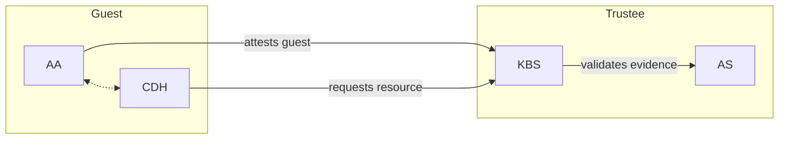
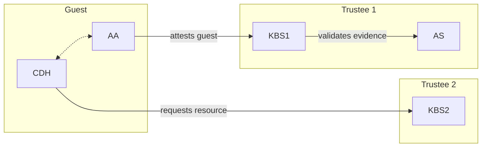

The Confidential Containers Key Broker Service (KBS) facilitates remote attestation and secret delivery. The KBS is an implementation of a [Relying Party](https://www.ietf.org/archive/id/draft-ietf-rats-architecture-22.html#name-relying-party) from the [Remote ATtestation ProcedureS (RATS) Architecture](https://www.ietf.org/archive/id/draft-ietf-rats-architecture-22.html). The KBS itself does not validate attestation evidence. Instead, it relies on the [Attestation-Service (AS)](../attestation-service/) to verify TEE evidence.

In conjunction with the AS or Intel Trust Authority (ITA), the KBS supports the following TEEs:

- AMD SEV-SNP
- AMD SEV-SNP on Azure with vTPM
- Intel TDX
- Intel TDX on Azure with vTPM
- Intel SGX
- ARM CCA
- Hygon CSV

## Deployment Configurations

The KBS can be deployed in several different environments, including as part of a docker compose cluster, part of a Kubernetes cluster or without any containerization. Additionally, the KBS can interact with other attestation components in different ways. This section focuses on the different ways the KBS can interact with other components.

### Background Check Mode

Background check mode is a more straightforward and simple way to configure the Key Broker Service (KBS) and Attestation-Service (AS). The term ["Background Check"](https://www.ietf.org/archive/id/draft-ietf-rats-architecture-22.html#section-5.2) is from the RATS architecture. In background check mode, the KBS directly forwards the hardware evidence of a confidential guest to the AS to validate. Once the validation passes, the KBS will release secrets to the confidential guest.

In background check mode, the KBS is the relying party and the AS is the verifier.

### Passport Mode

Passport mode decouples the provisioning of resources from the validation of evidence. In background check mode these tasks are already handled by separate components, but in passport mode they are decoupled even more. The term ["Passport"](https://www.ietf.org/archive/id/draft-ietf-rats-architecture-22.html#section-5.1) is from the RATS architecture.

In passport mode, there are two Key Broker Services (KBSes), one that uses a KBS to verify the evidence and a second to provision resources.

In the RATS passport model the client typically connects directly to the verifier to get an attestation token (a passport). In CoCo we do not support direct connections to the AS, so KBS1 serves as an intermediary. Together KBS1 and the AS represent the verifier. KBS2 is the relying party.

Passport mode is good for use cases when resource provisioning and attestation are handled by separate entities.
