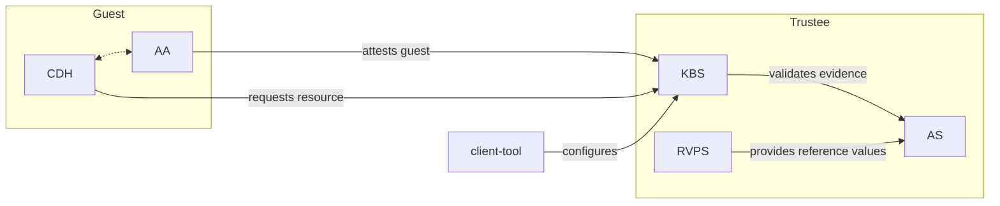

Trustee contains tools and components for attesting confidential guests and providing secrets to them. Collectively, these components are known as Trustee. Trustee typically operates on behalf of the ["workload provider"](../overview/trust-model/trust_model_personas/#workload-provider) / ["data owner"](../overview/trust-model/trust_model_personas/#data-owner) and interacts remotely with [guest components](../guest-components/).

Trustee is developed for the Confidential Containers project, but can be used with a wide variety of applications and hardware platforms.

## Architecture

Trustee is flexible and can be deployed in several different configurations. This figure shows one common way to deploy these components in conjunction with certain guest components.

### Legend

- `CDH`: Confidential Data Hub
- `AA`: Attestation Agent
- `KBS`: Key Broker Service
- `RVPS`: Reference Value Provider Service
- `AS`: Attestation Service
